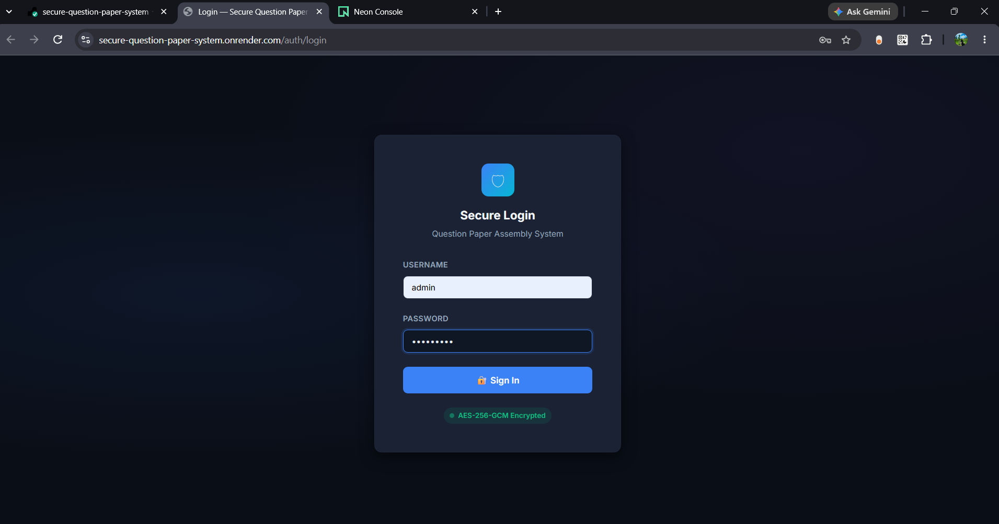
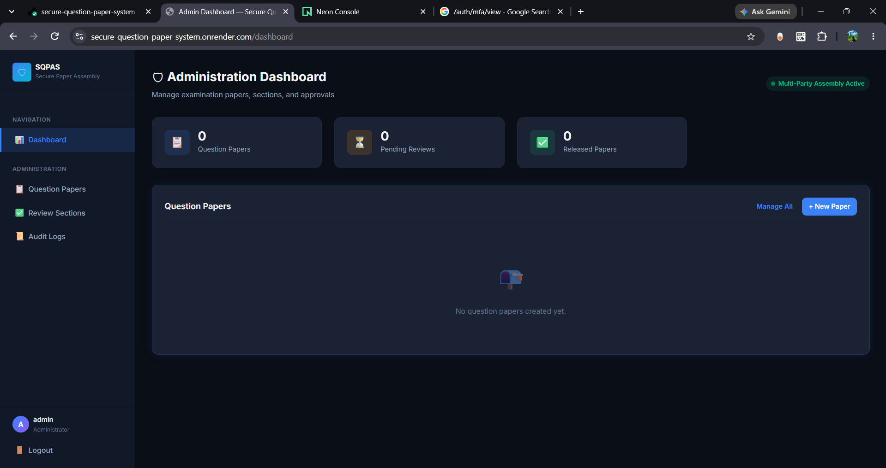

Secure Multi-Party Question Paper Assembly System (SQPAS)

SQPAS is a security-focused Flask application designed for the secure creation, independent preparation, multi-party assembly, approval, and controlled release of examination question papers.

The system combines role-based access control, encryption, multi-factor authentication, audit logging, and time-based release controls to protect examination content throughout its lifecycle.

Live Deployment

Application URL:
https://secure-question-paper-system.onrender.com/auth/login

Note: This deployment is intended for academic demonstration and project evaluation. It must not be used for real examination operations without a complete security audit, proper operational controls, and production hardening.

Key Features
Role-Based Access Control (RBAC)
Admin, examination officer, and question setter roles
AES-256-GCM encryption for question paper content
Independent question section preparation
Multi-party question paper assembly
Approval-based workflow
TOTP-based Multi-Factor Authentication (MFA)
MFA recovery using one-time recovery codes
Password re-verification for sensitive actions
SHA-256 integrity hashing
Time-based controlled release
Audit logging and security monitoring
PostgreSQL database support
Production deployment using Gunicorn and Render
Application Workflow
The administrator creates an examination paper.
The administrator creates paper sections.
Question setters are assigned to their respective sections.
Each setter independently prepares their assigned questions.
Setters submit their completed sections.
Authorized users review and approve the submitted sections.
The system assembles the approved sections into the final paper.
The final paper is encrypted and stored securely.
The examination officer releases the paper only after the configured release time.
The released paper is decrypted in memory for authorized access.
User Roles
Username	Role	Responsibility
admin	Administrator	Manage users, papers, assignments, and system settings
officer	Examination Officer	Review, approve, and release examination papers
setter_a	Question Setter A	Prepare and submit assigned question sections
setter_b	Question Setter B	Prepare and submit assigned question sections

Demo passwords and MFA setup details are generated locally by seed.py and stored in .demo_credentials.txt.

Security Warning: Never commit, upload, or publicly share .demo_credentials.txt. These credentials are intended only for local demonstration. Replace all demo credentials before any real deployment.

Security Architecture
Authentication and Authorization
Role-Based Access Control
Password-protected authentication
TOTP-based Multi-Factor Authentication
Recovery codes for MFA account recovery
Password confirmation for sensitive operations
Role-specific dashboards and permissions
Data Protection
AES-256-GCM encryption
Unique nonce generation
Authentication tags for ciphertext integrity
SHA-256 hashing for integrity verification
Environment-based secret and encryption key configuration
Decryption of final papers only when authorized and permitted
Workflow Security
Independent setter assignments
Separation of responsibilities
Approval before final assembly
Controlled release based on release time
Restricted access to unreleased papers
Audit records for important system activities
Technologies Used
Python 3
Flask
SQLAlchemy
PostgreSQL
Neon PostgreSQL
HTML5
CSS3
JavaScript
AES-256-GCM
TOTP / MFA
Gunicorn
Git
GitHub
Render
Project Structure
secure-question-paper-system/
├── app/
│   ├── __init__.py
│   ├── config.py
│   ├── extensions.py
│   ├── models/
│   ├── routes/
│   ├── services/
│   ├── templates/
│   └── static/
├── tests/
├── cloud/
├── requirements.txt
├── run.py
├── wsgi.py
├── gunicorn.conf.py
├── seed.py
├── migrate_recovery_codes.py
├── .env.example
├── AWS_DEPLOYMENT.md
└── README.md
Module Description
File/Directory	Purpose
app/__init__.py	Creates and configures the Flask application
app/config.py	Loads application and environment configuration
app/extensions.py	Initializes Flask extensions such as SQLAlchemy
app/models/	Defines database models and relationships
app/routes/	Contains authentication, admin, setter, and officer routes
app/services/	Contains encryption, MFA, and business logic
app/templates/	Contains HTML templates
app/static/	Contains CSS and JavaScript files
tests/	Contains automated tests
run.py	Starts the local development server
wsgi.py	Provides the production WSGI application
gunicorn.conf.py	Contains Gunicorn production server configuration
seed.py	Creates local/demo users and sample database data
migrate_recovery_codes.py	Creates the recovery-code table if it does not already exist
.env.example	Provides the required environment variable template
AWS_DEPLOYMENT.md	Provides AWS EC2 deployment instructions

The project structure should be updated if files or directories change during development.

Local Installation and Setup
1. Clone the Repository
git clone https://github.com/Harshidramprakash/secure-question-paper-system.git
cd secure-question-paper-system
2. Create a Virtual Environment

Windows PowerShell:

python -m venv venv
venv\Scripts\Activate.ps1

Linux/macOS:

python3 -m venv venv
source venv/bin/activate
3. Install Dependencies
pip install -r requirements.txt
4. Configure the Database

SQPAS requires a PostgreSQL-compatible database.

A development database can be created using Neon PostgreSQL or another PostgreSQL provider.

Create a .env file from the provided template:

cp .env.example .env

On Windows, copy .env.example manually and rename the copy to .env.

Configure the required environment variables:

DATABASE_URL=your_postgresql_connection_string
SECRET_KEY=your_application_secret_key
ENCRYPTION_KEY=your_64_character_hex_encryption_key
FLASK_ENV=development
ENVIRONMENT=development
DEV_AUTH_BYPASS=false

Important: Never commit .env to GitHub. It may contain database credentials, application secrets, and encryption keys.

5. Initialize the Local Demo Database
python seed.py

The seed script generates local demo users and stores their demo login and MFA setup details in:

.demo_credentials.txt

seed.py is intended for local/demo setup only. Do not run it against a production database unless its behavior has been verified and a backup is available.

6. Run the Application
python run.py

Open the local application URL displayed by Flask.

MFA Setup and Recovery

The application supports:

TOTP-based authentication
MFA enrollment
One-time recovery codes
MFA regeneration by authorized administrators

Users can access the MFA setup page through:

/auth/mfa/view

Recovery codes must be stored securely because each code can be used only once.

Regenerating MFA credentials invalidates the previous MFA secret and recovery codes.

Database Migration

The project includes an additive migration script for the MFA recovery-code table:

python migrate_recovery_codes.py

The migration script checks whether the recovery-code table exists and creates it only when required.

Do not use seed.py as a production migration tool. Production database changes should be performed using the dedicated migration process.

Render Deployment
Build Command
pip install -r requirements.txt
Start Command
gunicorn wsgi:app --config gunicorn.conf.py
Required Environment Variables

Configure these variables in the Render Web Service environment settings:

DATABASE_URL=your_postgresql_connection_string
SECRET_KEY=your_production_secret_key
ENCRYPTION_KEY=your_production_encryption_key
FLASK_ENV=production
ENVIRONMENT=production
DEV_AUTH_BYPASS=false

The Render DATABASE_URL value must contain only the PostgreSQL connection string. Do not include DATABASE_URL=, surrounding quotes, or shell commands inside the value.

Keep the same production ENCRYPTION_KEY. Changing it may prevent previously encrypted question papers from being decrypted.

AWS EC2 Deployment

Refer to AWS_DEPLOYMENT.md for deployment instructions using:

AWS EC2
Gunicorn
Nginx
PostgreSQL
Environment-based secret management
Production service configuration
Sample Input and Output
Sample Input

An administrator creates a new examination paper with the following details:

Field	Sample Value
Examination	MicroProject Internal Assessment
Subject	Computer Science and Engineering
Paper Title	Secure Systems Assessment
Section A	5 questions
Section B	5 questions
Setter A	Assigned to Section A
Setter B	Assigned to Section B
Release Time	10:00 AM

Setter A and Setter B log in using their assigned accounts, enter their questions, and submit their respective sections for approval.

Sample Output

After both setters submit their sections and the authorized user approves them, the system assembles the final question paper.

Paper Status: READY_FOR_RELEASE
Section A: Approved
Section B: Approved
Assembly Status: Completed
Encryption Status: Encrypted
Audit Status: Actions Recorded

Before the configured release time, the final question paper remains encrypted and cannot be accessed by unauthorized users.

After the release time, the examination officer releases the paper:

Paper Status: RELEASED
Release Status: Successful
Access: Authorized Officer Only

This demonstrates the complete workflow of question paper creation, independent section preparation, approval, secure encryption, assembly, audit logging, and controlled release.

Testing

The project includes automated tests for application functionality and security-related workflows.

Run the test suite using:

pytest -q

output:
login page: 

